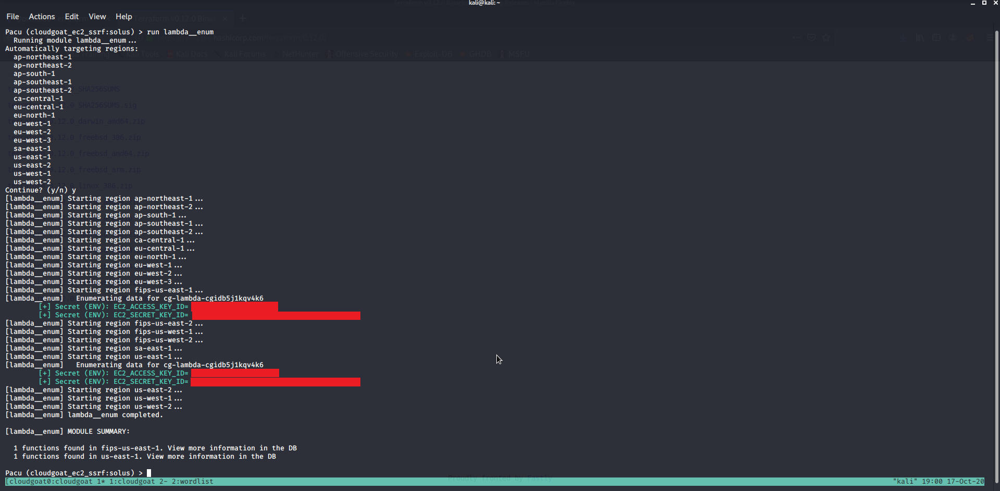

```
Github:

https://github.com/RhinoSecurityLabs/pacu
```
 
```
Pacu Testing Modules and Details:

https://github.com/RhinoSecurityLabs/pacu/wiki/Module-Details
```
 
```
Scenario:

Using Cloudgoat, you are given the IAM user Solus, then the attacker discovers the ReadOnly permissions to a Lambda function, where 
some hardcoded aws keys lead to a different user and you are able to set their AWS keys and further enumerate the AWS environment. In this test the module "lambda__enum"
was leveraged to enumerate Lambda access which can referenced in the PACU Module details page to enumerate AWS EC2 Keys through Lambda environment variables.
```
 
```
Deploy Cloudgoat Scenario ec2_ssrf after setting up Cloudgoat resources with Terraform
```


* Start EC2 SSRF Cloudgoat Scenario
  

<!-- .element height="200px" width="200px" -->

* Get Solus AWS Keys from Cloudgoat setup


 
```
Set Solus User Keys received from the Cloudgoat Initial Access and Look at their Access
```
 

* Start PACU and look at help screen to setup AWS Keys with testuser


* Set Solus AWS Keys with PACU set_keys module


* Confirm Solus Access and permissions


 
```
Enumerate Lambda Access
```

 * Run EC2 Enum Module in PACU

 

```
Receive New IAM User Keys through lambda__enum module which most likely utilized the ListFunctions or GetFunction/GetFunctionConfiguration AWS SDK Call to get our needed AWS Credentials
```
 

* Search Enumerated Data through PACU for AWS Credentials


* Check if Lambda Enumerated data is saved in PACU


* Setup New User with Found AWS Keys and run EC2 Enum Module


  
```
Reference:

https://rhinosecuritylabs.com/cloud-security/cloudgoat-aws-scenario-ec2_ssrf/
```
 